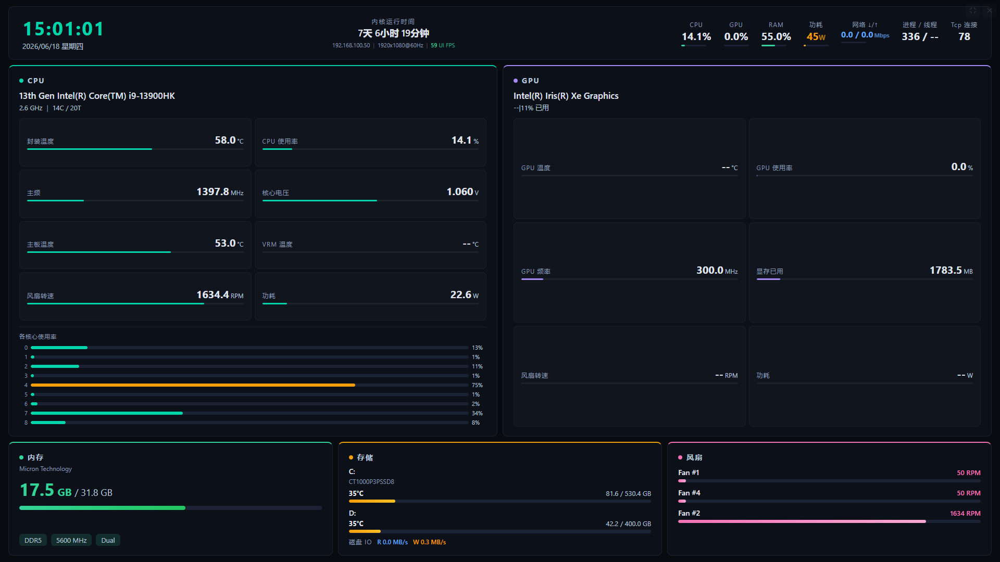

# Monitor Screen

Windows 副屏硬件监控工具，在第二块屏幕上全屏展示实时系统状态。



[下载地址](https://github.com/ai-written/monitorScreen/releases)

## 功能

- **CPU** — 型号、频率、核心/线程数、L3 缓存、封装温度、使用率、主频、核心电压、主板温度、VRM 温度、风扇转速、功耗、逐核心使用率
- **GPU** — 型号、显存规格、温度、使用率、频率、显存占用、风扇转速、功耗 (via nvidia-smi)
- **内存** — 已用/总量、类型、频率、通道、品牌
- **存储** — 各分区容量/温度 + 实时 IO 读写速率
- **风扇** — 各风扇 RPM 及百分比
- **网络** — 实时下载/上传速率、TCP 活跃连接数
- **系统** — 时钟、日期、运行时间、进程数、线程数、IP 地址、显示器分辨率/刷新率、UI 帧率
- **功耗** — 整机总功耗估算 (via LibreHardwareMonitor)

## 技术栈

- **后端** Go + [Wails v2](https://wails.io/)
- **前端** Vue 3 + Vite
- **系统监控** [gopsutil](https://github.com/shirou/gopsutil) + WMI + nvidia-smi
- **硬件传感器** [LibreHardwareMonitor](https://github.com/LibreHardwareMonitor/LibreHardwareMonitor) (可选)

## 环境要求

- Windows 10/11
- Go 1.22+
- Node.js 18+
- Wails CLI (`go install github.com/wailsapp/wails/v2/cmd/wails@latest`)
- **管理员权限**（硬件传感器需访问 SuperIO/MSR）

## 项目结构

```
├── main.go              # Wails 入口
├── app.go               # 核心逻辑、数据采集调度、窗口管理
├── tray.go              # 系统托盘
├── config.yaml          # 配置文件
├── model/               # 数据模型
├── collector/           # 数据采集器 (CPU/GPU/内存/磁盘/网络/系统)
├── lhm_bridge.cs        # LibreHardwareMonitor HTTP 桥接 (C#)
├── frontend/            # Vue 3 前端
│   ├── src/
│   │   ├── App.vue          # 根组件
│   │   ├── style.css        # 全局样式/变量
│   │   └── components/      # 各模块组件
├── build.bat            # 一键构建脚本
├── build_bridge.bat     # 编译 sensor_bridge.exe
├── setup_lhm.ps1        # 在线下载 LHM
├── setup_lhm_local.ps1  # 离线安装 LHM
└── lhm/                 # LHM 运行时文件 (构建后自动生成)
```

## 快速开始

### 1. 配置 LibreHardwareMonitor (可选，用于获取硬件传感器数据)

**在线安装：**
```powershell
.\setup_lhm.ps1
```

**离线安装（已下载 zip）：**
```powershell
.\setup_lhm_local.ps1
```

### 2. 修改配置

编辑 `config.yaml`：

```yaml
collector:
  interval: 1   # 数据采集间隔（秒）

lhm:
  enabled: "true"                     # 启用硬件传感器
  bridge_exe: 'lhm\sensor_bridge.exe'
  lhm_exe: 'lhm\LibreHardwareMonitor.exe'
```

不使用硬件传感器时将 `lhm.enabled` 设为 `"false"`，此时 CPU 温度、风扇转速、功耗等数据将显示 `--`。

### 3. 构建

```batch
.\build.bat
```

或手动：

```bash
# 编译 sensor_bridge (如启用 LHM)
.\build_bridge.bat

# 构建前端
cd frontend && npm install && npm run build && cd ..

# 构建 Wails 应用
wails build -ldflags="-s -w"
```

输出：`build\bin\monitorScreen.exe`

## 使用说明

- 启动后自动进入副屏全屏模式，若无副屏则在主屏显示
- 点击顶部栏可拖动窗口
- 按 `Esc` 退出/进入全屏
- 右上角按钮：切换全屏 / 退出程序
- 系统托盘右键菜单：显示窗口 / 关闭

## 工作原理

```
monitorScreen.exe (管理员权限)
  ├── gopsutil ───────── CPU/内存/磁盘/网络 (用户态)
  ├── WMI ────────────── 内存规格/磁盘型号/启动时间
  ├── nvidia-smi ─────── GPU 数据
  └── sensor_bridge.exe ─── LibreHardwareMonitor ─── 硬件传感器
                               ├── CPU 温度/电压/主频
                               ├── 主板/VRM 温度
                               ├── 风扇转速/百分比
                               └── 整机功耗
```

## 常见问题

**Q: 打开后所有数据都显示 `--`？**  
A: 确认 `config.yaml` 与 exe 在同一目录。检查 `lhm/` 目录下的 `sensor_bridge.exe` 和 `LibreHardwareMonitorLib.dll` 是否存在。硬件传感器数据需要管理员权限才能获取。

**Q: IP 地址显示不对？**  
A: 程序通过 UDP 连接到 `8.8.8.8` 来判断实际使用的网卡 IP，若断网则回退到第一个非回环 IPv4。

**Q: UI FPS 很低？**  
A: UI FPS 是 WebView 渲染帧率，不是游戏帧率。放到副屏时可能受限于集成显卡性能。

## License

MIT
